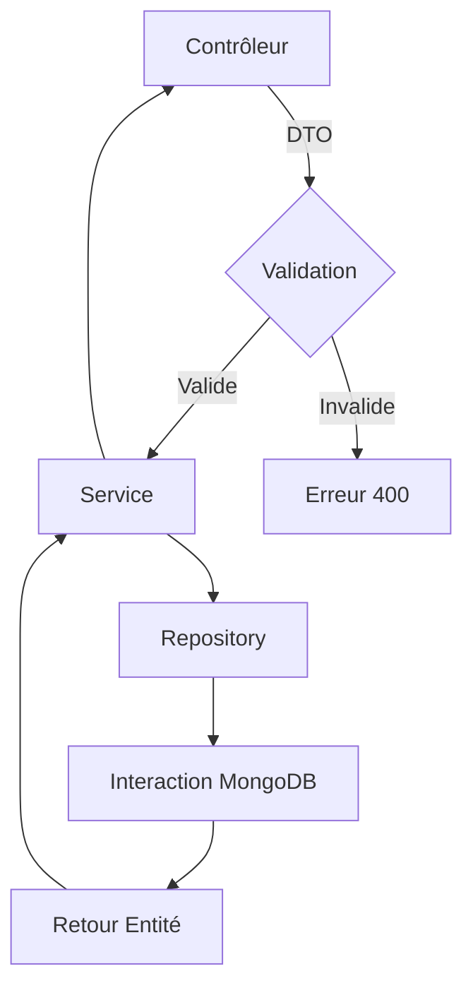

# Architecture de Données en NestJS avec MongoDB

## Concept et Avantages

### 1. Entité (Entity)
L'entité représente la structure de données dans la base MongoDB.

```typescript
// user.entity.ts
import { Prop, Schema, SchemaFactory } from '@nestjs/mongoose';
import { Document } from 'mongoose';

@Schema()
export class User extends Document {
  @Prop({ required: true })
  username: string;

  @Prop({ required: true })
  email: string;

  @Prop()
  age?: number;
}

export const UserSchema = SchemaFactory.createForClass(User);
```

#### Avantages :
- Définit la structure précise des données
- Garantit l'intégrité des données
- Permet la validation automatique
- Mappe directement avec le schéma MongoDB

### 2. DTO (Data Transfer Object)
Les DTOs contrôlent les données entrantes et sortantes.

```typescript
// create-user.dto.ts
import { IsString, IsEmail, IsOptional, IsNumber } from 'class-validator';

export class CreateUserDto {
  @IsString()
  username: string;

  @IsEmail()
  email: string;

  @IsOptional()
  @IsNumber()
  age?: number;
}
```

#### Avantages :
- Validation des données d'entrée
- Séparation entre le modèle de données et les données transmises
- Sécurité : contrôle précis des champs autorisés
- Protection contre la sur-exposition des données

### 3. Repository
Le repository gère les interactions avec la base de données.

```typescript
// user.repository.ts
import { Injectable } from '@nestjs/common';
import { InjectModel } from '@nestjs/mongoose';
import { Model } from 'mongoose';
import { User } from './user.entity';
import { CreateUserDto } from './create-user.dto';

@Injectable()
export class UserRepository {
  constructor(
    @InjectModel(User.name) private userModel: Model<User>
  ) {}

  async create(createUserDto: CreateUserDto): Promise<User> {
    const createdUser = new this.userModel(createUserDto);
    return createdUser.save();
  }

  async findAll(): Promise<User[]> {
    return this.userModel.find().exec();
  }

  async findById(id: string): Promise<User | null> {
    return this.userModel.findById(id).exec();
  }
}
```

#### Avantages :
- Abstraction des opérations de base de données
- Séparation des préoccupations
- Facilité de maintenance
- Réutilisabilité du code
- Testabilité améliorée

### 4. Service
Le service utilise le repository pour la logique métier.

```typescript
// user.service.ts
import { Injectable } from '@nestjs/common';
import { UserRepository } from './user.repository';
import { CreateUserDto } from './create-user.dto';
import { User } from './user.entity';

@Injectable()
export class UserService {
  constructor(private userRepository: UserRepository) {}

  async createUser(createUserDto: CreateUserDto): Promise<User> {
    // Logique métier supplémentaire possible
    return this.userRepository.create(createUserDto);
  }
}
```

## Flux de Fonctionnement



### Processus Détaillé
1. Le contrôleur reçoit une requête
2. Le DTO valide les données d'entrée
3. Le service traite la logique métier
4. Le repository interagit avec MongoDB
5. L'entité est retournée/manipulée

## Avantages Globaux
- Découplage des composants
- Validation robuste
- Sécurité des données
- Maintenabilité du code
- Flexibilité d'évolution

  # Flux de Fonctionnement Détaillé

## Diagramme de Flux


## Étapes Détaillées du Flux

### 1. Contrôleur (Endpoint)
- Point d'entrée initial de la requête
- Reçoit les données du client
- Transmet le DTO pour validation
- Exemple de méthode de contrôleur :
```typescript
@Post()
async createUser(@Body() createUserDto: CreateUserDto) {
  return this.userService.createUser(createUserDto);
}
```

### 2. Validation (Middleware)
- Utilise class-validator pour valider le DTO
- Vérifie :
  - Types de données
  - Contraintes définies
  - Complétude des informations
- En cas d'invalidité : 
  - Génère une erreur 400 (Bad Request)
  - Bloque la requête avant traitement

### 3. Service (Logique Métier)
- Réceptionne les données validées
- Applique la logique métier
- Coordonne les opérations
- Appelle le repository pour l'interaction base de données

### 4. Repository (Abstraction de Données)
- Gère les interactions directes avec MongoDB
- Effectue les opérations CRUD
- Transforme les données du DTO en document MongoDB

### 5. MongoDB
- Stockage et récupération des données
- Exécution des requêtes
- Retourne l'entité persistée/récupérée

### 6. Retour de Données
- L'entité remonte à travers les couches
- Transformation potentielle 
- Renvoi au contrôleur
- Réponse finale au client
